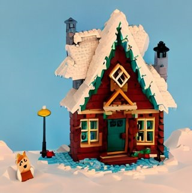
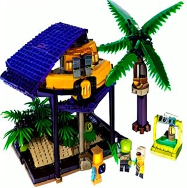
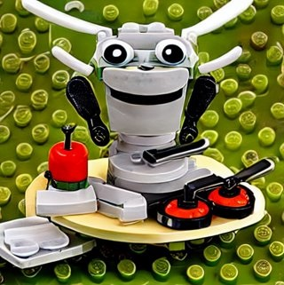
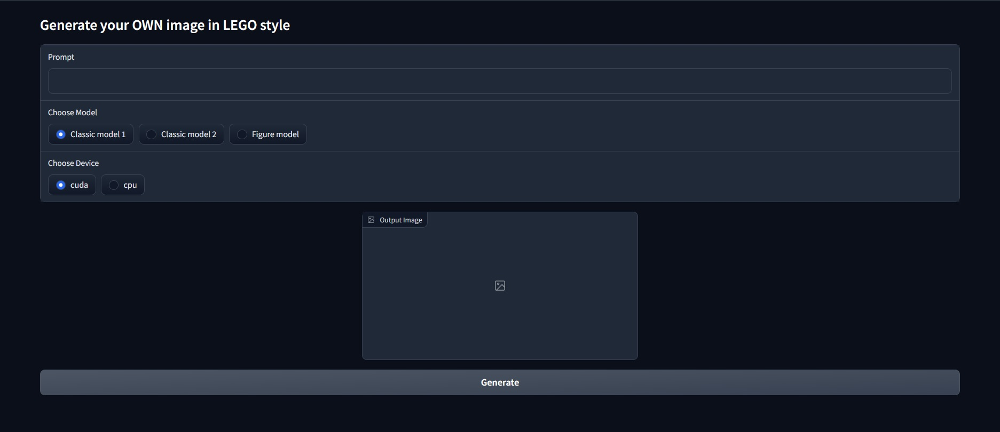

# LEGO_StableDiffusion
<h2>Overview</h2>
The project aim was to fine-tuned stable diffusion model in order to generate images in the LEGO style based on the prompt.

Fine-tuned model is created on top of Stable Diffusion text to image [model](https://huggingface.co/spaces/stabilityai/stable-diffusion).

To run app install requirements by typing: `pip3 install -r requirements`, then run the main app file `python3 app/main.py`, making sure you are in the root repo directory.

Database was created by our own by scraping the LEGO pictures from websites such as gettyimages.com, istockphoto.com and brickset.com (scripts available in the `Preprocessing` directory). 
Image captioning was done using BLIP [model](https://github.com/salesforce/BLIP). Image captioning script (`image_captioning.py`) is available in the `Preprocessing/BLIP` project directory. 
App is created using [gradio](https://gradio.app) library. In order to change GPU index or models' names do it in the `app/main.py` file.

If you require the LEGO database or model(s) drop us an email.

<h2>Results</h2>
<h3>Images:<h3>

Rubber Duck Aliens visiting  the Earth for the first time | A small cabin on top of a snowy  mountain in the style of Disney | A high tech solarpunk utopia  in the Amazon rainforest | An insect robot preparing  a delicious meal
:-------------------------:|:-------------------------:|:-------------------------:|:-------------------------:
 |  |  | 

<h3>App:</h3>

